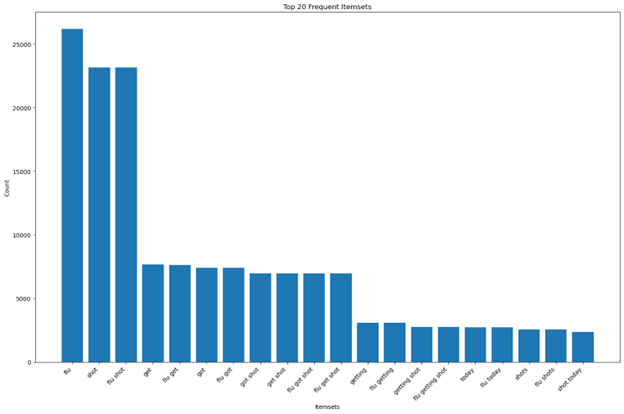

# Frequent Pattern Mining Implementation

## Project Overview
This project implements the Apriori algorithm for frequent itemset mining on Twitter data related to flu shots. The implementation analyzes keyword co-occurrence patterns in tweets to discover meaningful associations between terms.

## Features
- Implementation of the Apriori algorithm for frequent pattern mining
- Support for processing large-scale Twitter datasets
- Configurable minimum support threshold
- Output ranking system for discovered patterns
- Performance optimizations for handling large datasets

## Key Components
- **Pattern Mining Algorithm**: Core implementation of the Apriori algorithm
- **Data Processing**: Handles text data with keyword separators
- **Performance Monitoring**: Ensures efficient processing within specified time constraints
- **Results Generation**: Creates formatted output of discovered patterns with support counts

## Technical Details
The program accepts three command-line parameters:
1. Input dataset filename
2. Minimum support count threshold
3. Output filename

## Top 20 Patterns

### Author
- **Name**: Jinghan (Summer) Sun
- **Email**: jinghan.sun@emory.edu

